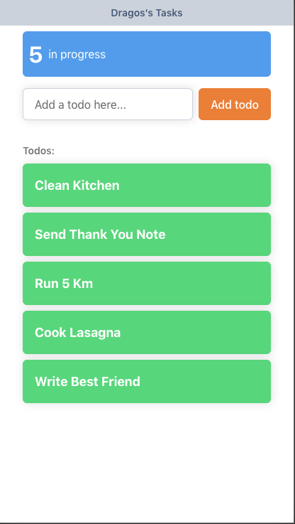
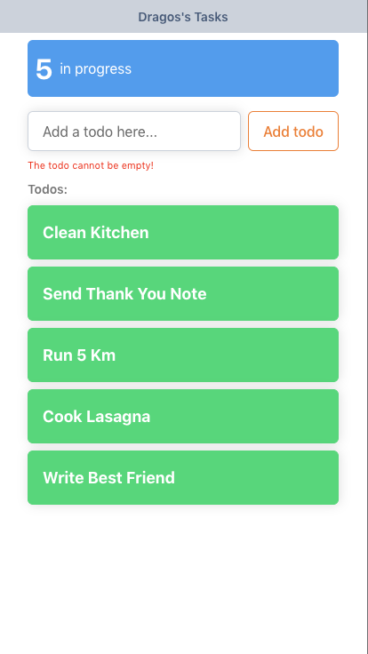

# To Do App with React 🚀

The goal of this assignment is to build a React Todos App.

Use the provided markup as a guide.

## Aceptance Criteria

```
As a user I want to take note of my todos.

Your objective is to add functionality to the app.

1. I type the name of a todo.

2. I press Enter (I submit the form).

3. The todo gets added to the list.

4. The number of todos is shown in the dashboard.

5. If there is not todo I won't be able to submit my form and and error will appear.
```

## Expected Result

Check the live demo here: [Live Demo](https://code-with-dragos-react.netlify.app/).




## Hints

Follow the comments in the code, they will lead you to the answers.

### To run the app:

```
npm install
```

and

```
npm start
```

## Bonus

I want you to store my todos in the local storage so I don't lose them when the page reloads.

Your users will be delighted.

## Final words

Make sure you create a new repo by forking this one.

Use meaningful commit names and save your work regularly.

Deploy the app to Github pages or Netlify.

---

© 2019 - 2020 CodeWithDragos. All Rights Reserved.
